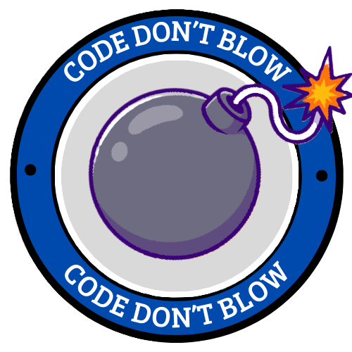
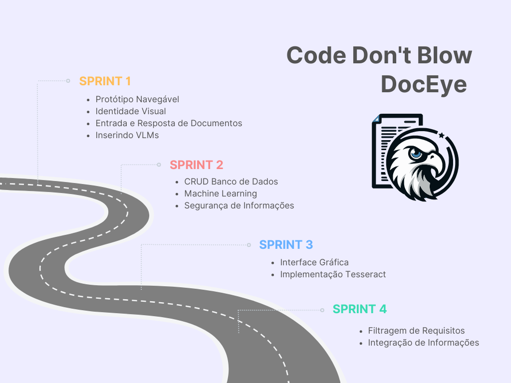

<h1 align="center">  Projeto API - 2º Semestre </h1>

    

## 📌 Tema

Muitas empresas lidam com milhares de documentos diariamente, como currículos, contas, notas fiscais e assim por diante. Porém, _extrair informações_ destes documentos é uma atividade difícil que depende da ação humana (mais lenta que computadores), pois retirar apenas o texto pode não ser suficiente, visto que as informações dependem do layout visual.

---

## 🎯 Objetivo do Projeto  

**Desenvolvimento de uma interface gráfica com Java Desktop, utilizando VLM (Vision Language Model) para a extração de informações de documentos, armazenando e manipulando em um banco de dados.** O sistema será capaz de ler, extrair e devolver a requisição feita pelo usuário. Será utilizado modelos de inteligência artificial para melhorar a praticidade e escalamento.

---

## 📅 Cronograma e Sprints

| Sprint            | Início     | Status       |
| ----------------- | ---------- | ------------ |
| Kick Off          | 29/08/2024 | Concluído    |
| 01                | 09/09/2024 | Concluído |
| 02                | 30/09/2024 | Concluído     |
| 03                | 21/10/2024 | Concluído      |
| 04                | 11/11/2024 | Concluído    |
| Feira de Soluções | 12/12/2024 | Concluído      |

---

## 📚 MVP (Minimum Viable Product)
**DocEye** é um software de extração de informações desenvolvido para automatizar e otimizar _processos seletivos_, facilitando a análise de documentos como os currículos. Seu principal objetivo é transformar informações não estruturadas, como texto em arquivos PDF ou imagens, em dados organizados e de fácil acesso para recrutadores e gestores de recursos humanos.
  _Descrição_: O DocEye utiliza tecnologias para identificar e extrair informações essenciais dos documentos, como nome, contato e competências. Esses dados são processados e apresentados em um formato estruturado, permitindo aos profissionais responsáveis pela seleção filtrarem candidatos de forma rápida e eficiente.
<!--   Acesse o link para visualizar o <a href= "https://www.figma.com/design/cK5bG9Pws6F5LTYGKAlwJ6/Prot%C3%B3tipo-API-2?node-id=0-1&node-type=canvas&t=jx5W8A6itDAJyiTB-0"> Protótipo DocEye! </a>    -->

---

## 🔊 Demonstração 

### Sprint 1

https://github.com/user-attachments/assets/2f176f5b-d2a3-4063-8a28-7dd9ed989ded 

### Sprint 2

https://github.com/user-attachments/assets/11b7606e-483b-46ff-addb-7474e2a48734

### Sprint 3

https://github.com/user-attachments/assets/8b01aa03-7700-40de-b9e9-e6c667162a6f

### Sprint 4

https://github.com/user-attachments/assets/cfbeafe9-02f1-4d6c-96b3-4dd9c57c8d21

---

## 🛤️ Roadmap

---

## 📝 Levantamento de Requisitos

|          ID           |                     Descrição                      |         Requisito          |
| :-------------------: | :----------------------------------------------------------: | :-------------: |
| RQ01 | O usuário poderá submeter documentos para modelos de linguagem e visão. |Funcional|
| RQ02 | O software deverá tratar a saída dada por esses modelos.|Funcional|
| RQ03 | Criar uma interface para cadastrar documentos.|Funcional|
| RQ04 | Criar uma interface para para exibir resultados. |Funcional|
| RQ05 | O usuário poderá cadastrar informações extraídas em um banco de dados relacional. |Funcional|
| RQ06 | O usuário poderá recuperar informações do banco de dados. |Funcional|
| RQ07 | O usuário poderá editar informações do banco de dados. |Funcional|
| RQ08 | O usuário poderá deletar informações do banco de dados. |Funcional|
| RQ09 | O software não poderá utilizar nenhuma API externa. |Não Funcional|
| RQ10 | A aplicação precisa rodar localmente na máquina. |Não Funcional|
| RQ11 | A aplicação deve conter uma interface minimalista e intuitiva. |Não Funcional|

---

## 📑 Backlog do Produto

| Rank  | Prioridade |                    User Story                    | Estimativa | Sprint |
|:-----:|:----------:|:------------------------------------------------:|:----------:|:------:|
| 1 | Alta | Como usuário, ter um modelo de inteligência artificial integrada na aplicação, para extração de informações presentes nos documentos | 13 | 1 |
| 2 | Alta | Como usuário, poder carregar documentos, para que a aplicação extraia as informações importantes | 18 | 1 |
| 3 | Alta | Como usuário, ter as informações extraídas armazenadas em um banco de dados, para permanência dos dados | 4 | 1 |
| 4 | Alta| Como usuário, ter acesso e poder manipular o banco de dados, para exclusão e leitura das informações cadastradas | 13 | 2 |
| 5 | Alta | Como usuário, cadastrar automaticamente as informações extraídas pela inteligência artificial, para automatização do processo | 8 | 2 |
| 6 | Alta | Como usuário, poder acessar as funcionalidades da aplicação por meio de uma interface minimalista e intuitiva, para facilitação no uso do serviço | 18 | 3 |
|   7   | Média | Como usuário, tratar a saída da inteligência artificial, para realizar a inserção automática | 13 | 2 |
|   8   | Média | Como usuário, ter um modelo de inteligência artificial exclusivo da aplicação, para ter uma resposta ideal na extração | 18 | 3 |
|   9   | Média | Como usuário, fazer filtragem dos currículos cadastrados no banco de dados, baseado em requisitos | 8 | 4 |
|  10   | Baixa | Como usuário, ter garantia na segurança dos dados extraídos, para evitar ataques | 3 | 4 |
|  11   | Baixa | Como usuário, ter um manual detalhado, para entender o funcionamento completo do software | 18 | 4 |

## 🏗️ Arquitetura do Sistema

O sistema será baseado em uma arquitetura de **camadas**, onde cada parte desempenha um papel específico no processo:

- **Frontend (Interface Gráfica)**: Desenvolvido em Java com uso de bibliotecas gráficas (JavaFX ou Swing), permitindo uma interação amigável para o usuário final.
- **Backend**: Responsável pelo processamento de dados, comunicação com o banco de dados (MySQL), e integração com inteligência artificial.
- **IA/Leitura de Documentos**: Utilização de modelos treinados para a leitura automática de documentos e reconhecimento de caracteres.
- **Banco de Dados**: MySQL para armazenar os dados dos documentos, usuários e logs do sistema.

---

## 🛠️ Tecnologias Utilizadas

Ferramentas e plataformas aplicadas no desenvolvimento do projeto:
- Figma 🎨 
- Git e GitHub 🐙
- IntelliJ IDEA 🖥️
- Java ☕
- Ollama 🧠 (Modelos de IA)
- MySQL 🗄️
- Draw.io 📊
- Markdown 📝
- Trello 🔧
- Google Sheets 📑

---

## 📋 Para Executar o Projeto

### Pré-requisitos:

- **Java Development Kit (JDK)**: Certifique-se de ter o JDK 11 ou superior instalado.
- **MySQL**: Banco de dados utilizado no projeto.
- **Git**: Para clonar o repositório.
- **IDE**: Como IntelliJ IDEA ou NetBeans.
- **Tess4J**: Biblioteca para integrar o Tesseract ao Java, permitindo realizar o OCR.
- **Tesseract OCR**: Ferramenta de OCR para extração de texto a partir de imagens.
- **JavaFX**: Framework para a criação de interfaces gráficas de usuário (GUI).

---

 ###  Fatec São José dos Campos - Prof. Jessen Vidal

| Cliente          | Período/Curso                                  | Professor M2      | Professor P2     | Contato Cliente                    |
| ---------------- | ---------------------------------------------- | ----------------- | ---------------- | ---------------------------------- |
| Giuliano Bertoti | 2º ADS (Análise e Desenvolvimento de Sistemas) | Cláudio Etelvino  | Giuliano Bertoti | <giuliano.bertoti@fatec.sp.gov.br> |

## 👥 A Equipe Code Don´t Blow

| Integrante | Função | GitHub | 
|---|---|---|
| Rafael Gonçalves | **Product Owner** |   | 
| Leonardo Cristiano | **Scrum Master** |  | 
| Luana Souza | Dev Team |  | 
| Mariana Lins | Dev Team |  | 
| Matheus di Sabatino | Dev Team |  |
| Ygor Pereira | Dev Team | 
| Vanessa da Costa | Dev Team |  | 
| Henrique Tadeu | Dev Team |  | 

