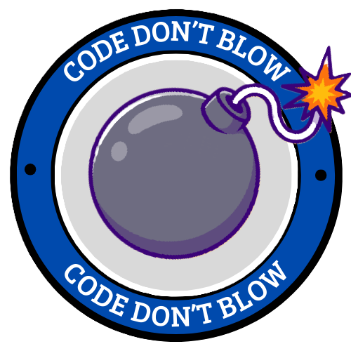
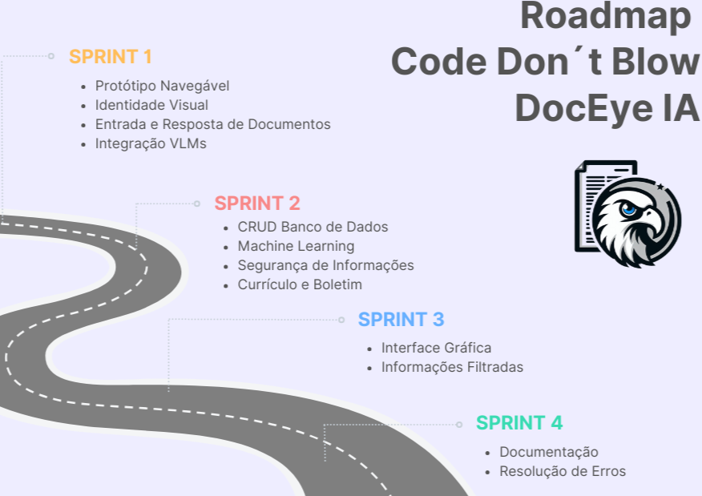

# API-2 

    

- 2º Semestre de 2024 -
- Fatec São José dos Campos -

## 📌 Tema

Muitas empresas lidam com milhares de documentos diariamente, como currículos, contas, notas fiscais e assim por diante. Porém, extrair informações destes documentos é uma atividade difícil que depende da atividade humana (mais lenta que computadores) pois apenas retirar o texto pode não ser suficiente visto que as informações dependem do layout visual.

---

## 📚 Objetivo do Projeto 🎯

**Desenvolvimento de uma interface gráfica com Java Desktop, utilizando VLM(Vision Language Model) para a extração de informações de documentos, armazenando e manipulando num banco de dados.** O sistema será capaz de ler, extrair e devolver a requisição feita pelo usuário. Será utilizado modelos de inteligência artificial para melhorar a praticidade e escalamento.

---

## 📅 Cronograma e Sprints

| Sprint            | Início     | Status       |
| ----------------- | ---------- | ------------ |
| Kick Off          | 29/08/2024 | Concluído    |
| 01                | 09/09/2024 | Concluído |
| 02                | 30/09/2024 | Em progresso     |
| 03                | 21/10/2024 | A fazer      |
| 04                | 11/11/2024 | A fazer      |
| Feira de Soluções | 12/12/2024 | A fazer      |

## Sprint 2. MVP (Minimum Viable Product)

[//]: # (TEM QUE COLOCAR AS IMAGENS E O VIDEO DO MVP)
- [x] 
- []

## 🛤️ Roadmap

---

## 📝 Levantamento de Requisitos

|          ID           |                     Descrição                      |         Requisito          |
| :-------------------: | :----------------------------------------------------------: | :-------------: |
| RQ01 | O usuário poderá submeter documentos para modelos de linguagem e visão. |Funcional|
| RQ02 | O software deverá tratar a saída dada por esses modelos.|Funcional|
| RQ03 | Criar uma interface para cadastrar documentos.|Funcional|
| RQ04 | Criar uma interface para para exibir resultados. |Funcional|
| RQ05 | O usuário poderá cadastrar informações extraídas em um banco de dados relacional. |Funcional|
| RQ06 | O usuário poderá recuperar informações do banco de dados. |Funcional|
| RQ07 | O usuário poderá editar informações do banco de dados. |Funcional|
| RQ08 | O usuário poderá deletar informações do banco de dados. |Funcional|
| RQ09 | O software não poderá utilizar nenhuma API externa. |Não Funcional|
| RQ10 | A aplicação precisa rodar localmente na máquina. |Não Funcional|
| RQ11 | A aplicação deve conter uma interface minimalista e intuitiva. |Não Funcional|

---

## 🏗️ Arquitetura do Sistema

O sistema será baseado em uma arquitetura de **camadas**, onde cada parte desempenha um papel específico no processo:

- **Frontend (Interface Gráfica)**: Desenvolvido em Java com uso de bibliotecas gráficas (JavaFX ou Swing), permitindo uma interação amigável para o usuário final.
- **Backend**: Responsável pelo processamento de dados, comunicação com o banco de dados (MySQL), e integração com a inteligência artificial (XYZ/XY/ZX/X).
- **IA/Leitura de Documentos**: Utilização de modelos treinados para a leitura automática de documentos e reconhecimento de caracteres.
- **Banco de Dados**: MySQL para armazenar os dados dos documentos, usuários e logs do sistema.

---

## 🛠️ Tecnologias Utilizadas

Ferramentas e plataformas aplicadas no desenvolvimento do projeto:
<!-- COLOCAR OS ICONES -->
<!-- - Figma 🎨 -->
- Git e GitHub 🐙
- IntelliJ IDEA 🖥️
- Java ☕
- Ollama 🧠 (Modelos de IA)
- MySQL 🗄️
- Draw.io 📊
- Markdown 📝
- Trello 🔧
- Google Sheets 📑

---

## 🏗️ Como Instalar e Executar o Projeto

### Pré-requisitos:

- **Java Development Kit (JDK)**: Certifique-se de ter o JDK 11 ou superior instalado.
- **MySQL**: Banco de dados utilizado no projeto.
- **Git**: Para clonar o repositório.
- **IDE**: Como IntelliJ IDEA ou NetBeans.

<!-- ### Passos de Instalação: -->

---

| Cliente          | Periodo/Curso                                  | Professor M2      | Professor P2     | Contato Cliente                    |
| ---------------- | ---------------------------------------------- | ----------------- | ---------------- | ---------------------------------- |
| Giuliano Bertoti | 2º ADS (Análise e Desenvolvimento de Sistemas) | Cláudio Etelvino  | Giuliano Bertoti | <giuliano.bertoti@fatec.sp.gov.br> |
---

## 👥 A Equipe Code Don´t Blow

| Integrante | 1° SEM | 2° SEM | GitHub | 
|---|---|---|---|
| Ygor Pereira | Dev Team | **Product Owner** |  | 
| Leonardo Cristiano | **Product Owner** | **Scrum Master** |  | 
| Luana Souza | **Scrum Master** | Dev Team |  | 
| Mariana Lins | Dev Team | Dev Team |  | 
| Matheus di Sabatino | Dev Team | Dev Team |  |
| Rafael Gonçalves | Dev Team | Dev Team |  
| Vanessa da Costa | Dev Team | Dev Team |  | 
| Henrique Tadeu | Dev Team | Dev Team |  | 

